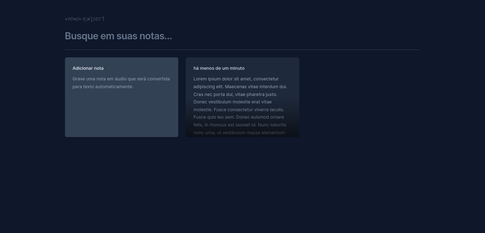

    

<h1>O que é o NLW?</h1>

O NLW, ou Next Level Week, é o maior evento de programação na prática oferecido pela Rocketseat. É uma experiência intensiva de código, desafios e networking, projetada para levar sua carreira para o próximo nível. Desenvolva projetos inéditos, explore novas tecnologias, aprimore suas habilidades e conecte-se com uma comunidade exclusiva!

## Trilha ReactJS

O evento tinha varios caminhos a serem seguidos, porem eu escolhi o caminho do ReactJS. aprendemos a desenvolver um projeto completo em 3 aulas, que é um site para criar e salvar notas, inclusive transcrever o que é falado no microfone!

## Preview

    
  

### Link do Projeto

🚀 https://yagosousaa.github.io/notes-project-2024/

### 👨‍💻 Tecnologias

Esse projeto foi desenvolvido com as seguintes tecnologias:

- SpeechRecognition API
- ReactJS
- TailwindCSS
- Figma

    by Yago.

